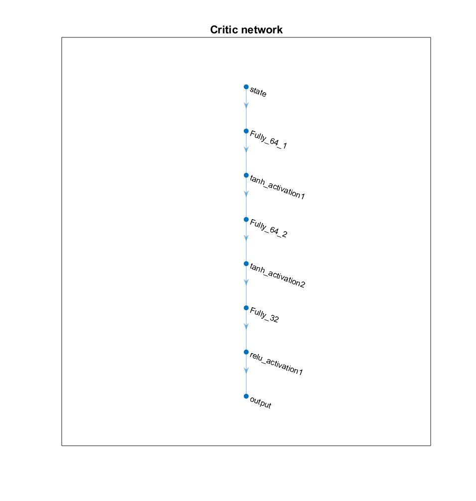
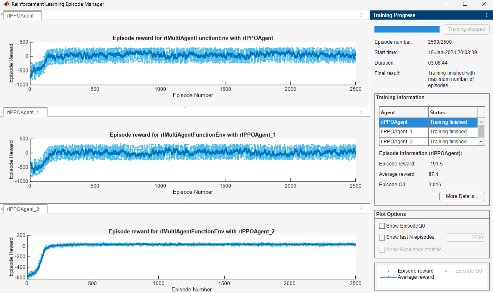
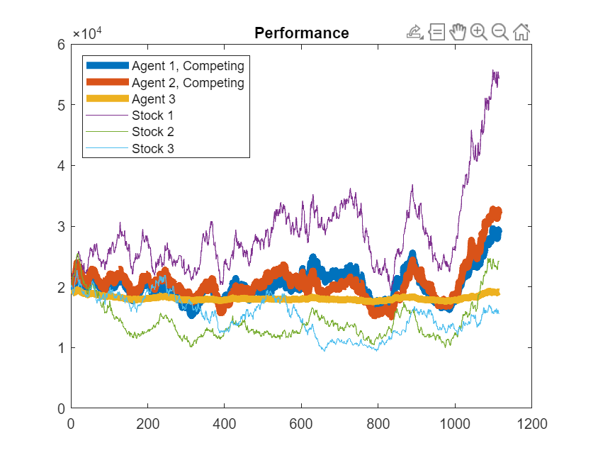

# **Reinforcement Learning For Financial Trading**  :chart_with_upwards_trend:

How to use Reinforcement learning for financial trading using Simulated Stock Data using **[MATLAB](https://www.mathworks.com/products/matlab.html)**. This project is split into two sections: 

1. [Single Agent Learning](#section-1)
2. [Multiagent Learning](#section-2)

#  Single Agent Learning Setup

To run:

1. Open RL_trading_demo.prj
2. Open workflow.mlx (MATLAB Live Script **preferred**) or workflow.m (MATLAB script **viewable in GitHub**)
3. Run workflow.mlx

Environment and Reward can be found in:
myStepFunction.m

Requires

- [MATLAB version >= R2019b](https://www.mathworks.com/products/matlab.html)
- [Deep Learning Toolbox](https://www.mathworks.com/products/deep-learning.html)
- [Reinforcement Learning Toolbox](https://www.mathworks.com/products/reinforcement-learning.html)
- [Financial Toolbox](https://www.mathworks.com/products/finance.html)

## Overview

The goal of the Reinforcement Learning agent is simple. Learn how to trade the financial markets without ever losing money. 

Note, this is different from learn how to trade the market and make the most money possible.

## Reinforcement Learning for Financial Trading

Lets apply some of the terminology and concepts of teaching a reinforcement learning agent to trade.

- The agent in this case study is the computer.
- It will observe financial market indicators (states).
- The financial market is the environment.
- The actions it can take are buy, hold sell.
- It needs to learn which action to take and when (policy).
- It learns by understanding what is a good trade or a bad trade via rewards.

## Case Study 

Our environment consists of 3 stocks, $20000 cash & 15 years of historical data:

Stocks are:

- Simulated via Geometric Brownian Motion or
- Historical Market data ([source: AlphaVantage](https://www.alphavantage.co/))

**Action Space**: (buy, sell ,hold) for 3 stocks = 27 total actions

**Observation Space**:

- Stocks Owned
- Price Different when Bought
- Cash In Hand
- Price change from yesterday
- % Price change from 2 days ago
- % Price change from 7 days ago
- % Price change from average price of 7 days ago

## Strategy

- Given 3 stocks
- Try to find the best time to buy, sell, or hold each stock
- If selling a stock, sell all of it.
- If buying a stock, buy the maximum allowed given cash in hand.

## Reward

The reward system was what took the most time to develop and required several iterations.

The details are listed, but to simplify

A good reward is given when a trade results in a profit and a stock is bought/held/sold at the right time. For example buying a stock on the way up.

The reverse goes for giving a penalty except for one thing.

A large penalty is given if ANY trade of the 3 stocks is determined as a bad trade. WHY? In the first iteration of the reward system, this was not there. What was observed is that the agent quickly learnt the best of the 3 stocks to trade and ignored the other 2. 

- A good reward is given when
    - A selling trade results in profit
    - A selling trade occurs with momentum
        - I.e. selling when prices start to fall
    -Holding a stock results in the portfolio value increasing
- A bad reward is given when
    - Selling results in a negative profit
    - A selling trade occurs against momentum
        - I.e. selling when prices are increasing, buying when prices are falling
    - Holding a stock results in the portfolio value decreasing
    - A good reward is overwritten to be bad if any illogical trade occurs
        - I.e. sell a stock you don’t have or buy when you don’t had cash 

## Training

- Based 12years of data
- 3000 episodes
- ~80hrs to train

Here is an overview of how long it took to learn. You might think 80hrs is a long time. But remember, how long do you think it takes a human to learn how to trade successfully over 12 years?

## Results

**Highlights**
- 100 Simulations of 3 years:
    - Average profit - ~$30k
    - 0 simulations returned negative
    - But most did not outperform individual stocks

**Histogram of 100 Simulations**

**Best Simulation**

**Worst Simulation**

The histogram shows that for 100 simulations, not once did the agent ever lose money. So the goal was achieved! 

However, you can see that the range varies quite a bit. If you inspect the plots on the right,  just buying and holding 1 stock would returned a profit just as good if not better than the agent.

BUT – It’s easy to judge retrospectively. The agent was trading each day as it occurred.  None of the simulations resulted in a loss.

## Further Improvements 

The case study did ignore some common things to consider when trading the market.  Here a few areas that could improve the performance, and make the trained agent more robust:

- Include Transaction costs
- Cover the Hi/Lo spread
- Refined reward system
- Compare different agents

## Conclusion - Single Agent Case

The aim of this example was to show:

- What reinforcement learning is
- How it can be applied to trading the financial markets
- Leave a starting point for financial professionals to use and enhance using their own domain expertise.

#  Multiagent Learning Setup

The example is to show the use of Multiagent Reinforcement Learning for Financial Trading. In this example, agents compete to outperform each other. They are rewarded when they outcompete the other, and penalized when they underperform. 

## Setup
To run:

1. Open RL_trading_demo.prj
2. Open workflowMulti.mlx
3. Run workflowMutli.mlx

Requires

- [MATLAB version >= R2023b](https://www.mathworks.com/products/matlab.html)
- [Deep Learning Toolbox](https://www.mathworks.com/products/deep-learning.html)
- [Reinforcement Learning Toolbox](https://www.mathworks.com/products/reinforcement-learning.html)
- [Financial Toolbox](https://www.mathworks.com/products/finance.html)

## Overview
MATLAB R2023b has introduced a new feature that allows for multiagent reinforcement learning, whereby multiple agents interract in the same environment. These agents can either collaborate towards a common goal or compete against each other. 

In this example, two agents compete against each other to outperform each other in trading stocks. They attempt to learn a better strategy that results in a higher profit than their competitor. 

These agents mimic the inherently competitive nature of trading - they fight against their foe to optimize their strategy!

**Note that the environment is nearly identical to the Single Agent Example**. These agents have the same action space and observation space. Each agent also shares the same reward function mentioned in the Signle Agent Example, but two of the agents in this example extend this reward function as mentioned later. 

## Case Study 
Define the **three** [Proximal Policy Optimization (PPO) agents](https://www.mathworks.com/help/reinforcement-learning/ug/ppo-agents.html) by defining an actor and a critic. These agents could be defined using the [Deep Network Designer](https://www.mathworks.com/help/deeplearning/gs/get-started-with-deep-network-designer.html), although this example defines the networks programatically. The network architecture for each agent follows: 

**Observation Space**: at each time step, each agent observes 19 different continuous values specififed in the Single Agent Example. 

**Action Space**: contains 27 possible actions, just like in the Single Agent Example. 

### Reward Function
All three agents share a common reward function, and agents 1 and 2 add on to this reward function with a specialized competitive reward. 

**Shared reward for all agents**: Give the agent +1 as a reward if they made a profit or if they sold stocks while its indicators were suggesting a negative trajectory. Give the agent -1 otherwise. This reward is **identical** to the reward in the Single Agent Case. 

**Competitive reward for agents 1 and 2**: Give the agent +0.5 as a reward if it has made more of a profit than its competitor, give the agent -0.5 otherwise. 

Given that agent 3 does not contain the competitive reward, a greater performance in agents 1 and 2 would indicate that the competitive strategy aids in learning. 

## Training
Agents were trained for 2,500 episodes, where each episode contained 2,597 steps (length of training data). The results from the agent as shown in the Episode Manager are shown below:  

As shown in this image, agents 1 and 2 constantly battle to outcompete each other. 

## Results
As shown in the results below, agents 1 and 2 outperform agent 3 -- their competitive nature aids in learning. Further, agents 1 and 2 over 1.5x their initial $20,000 on the test dataset. 

These results demonstrate the effectiveness of utilizing competitive agents for the Stock Trading Problem. While the competing agents do not always outperform their soltitary  counterpart (Agent 3), this work proves the utility and possibility of using this multiagent paradigm! 

In the future, this idea could be expanded to many other areas in finance -- multiagent reinforcement learning is currently an active area of research, as its competitive nature lends itself well to the inherently competitive world of finance. 

## For more information on Reinforcement Learning in MATLAB:
**[Free Reinforcement Learning Onramp - No downloads, or installation, just your browser and you!](https://nl.mathworks.com/learn/tutorials/reinforcement-learning-onramp.html)**

**[Download a free trial](https://www.mathworks.com/products/reinforcement-learning.html)**

**[Getting Started with Reinforcement Learning (YouTube series)](https://www.youtube.com/watch?v=pc-H4vyg2L4&feature=youtu.be)**

Copyright 2020 The MathWorks, Inc.

